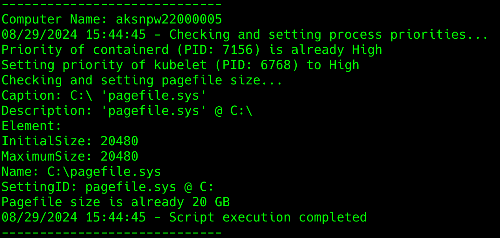

# Windows Daemon Configuration

This project contains the configuration files for DaemonSet and Pod running in Windows environment, suitable for Windows nodes in Kubernetes cluster.

## windows-daemonset-configmap.yaml

This file contains the configuration for DaemonSet that runs on Windows nodes in Kubernetes cluster. The DaemonSet runs a Pod that mounts the ConfigMap volume and run the script `cronjob.ps1` to configure the Windows node.

